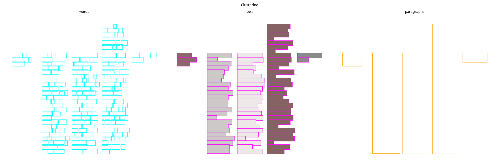

# ReadingBank2Paragraph

This is a byproduct of a university project.
The project itself was about document analysis based on a documents' layout.

## How it works

The [ReadingBank](https://github.com/doc-analysis/ReadingBank) dataset consists of boxes which are representing words.
Those are clustered into lines or rows.
Finally, those rows are clustered again into paragraphs using agglomerative clustering.

In order to find the closest boxes (which representing lines) a customized manhattan-distance based distance is used.
This distance calculates the closest distance between two boxes.
If they overlap in one dimension (x- or y-axis) the distance is 0.

Since multiple lines (horizontally and vertically) can form a single paragraph two thresholds are used.
You can find and change those the [config.py](src/config.py)-file.
Namely, they are ``DISTANCE_THRESHOLD`` and ``CLUSTER_THRESHOLD``.  
While ``DISTANCE_THRESHOLD`` is used as threshold for the distance in x-axis direction, ``CLUSTER_THRESHOLD`` is used for the distance in y-axis direction. 

## How to use this code

### Installation
1. ``pip install -r requirements.txt``
2. ``cd src/``
3. ``python example.py``

### Usage

You can find in [example.py](src/example.py) the intended usage.
The lines in focus are:
```python
clustered_document = process(readingbank_document)
visualize_readingbank_document(
    doc=clustered_document,
    paragraphs_affiliation=clustered_document["paragraph_class_per_line"],
)
```
This produces a plot like this one:


This Repository's intended use is to work with documents which are given in the format of the ReadingBanks format.
This includes (only) the layout information.
If you want to use an arbitrary document, make sure it is a json-object containing the keys: ``src`` and ``tgt``.  
Examples are given in the [example.jsonl](data/example.jsonl)-file.

# Questions?
Feel free to open an issue, if you need guidance or want to discuss things.